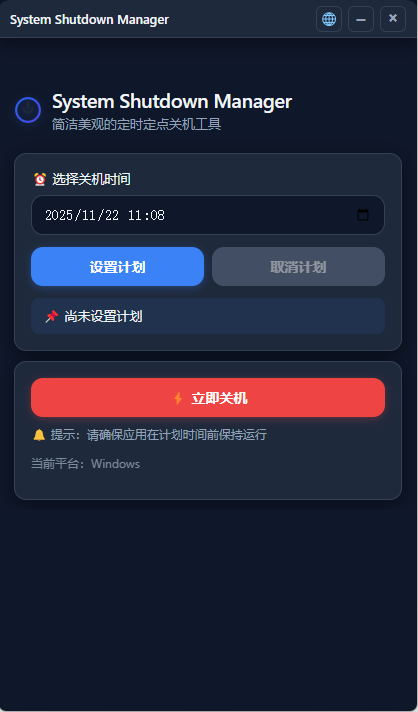
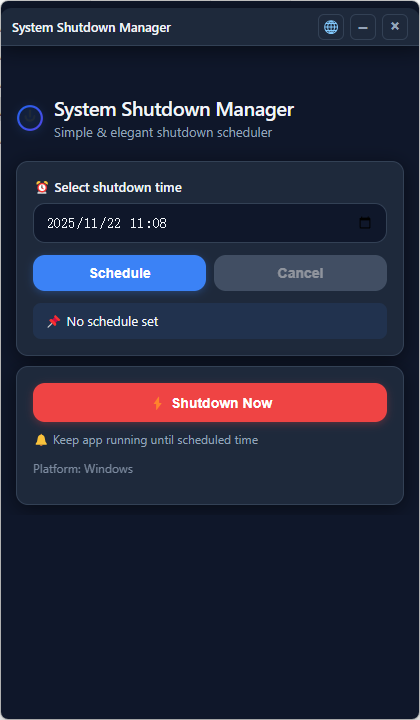

# System Shutdown Manager

一个跨平台的定时定点关机管理工具，支持 Windows 和 macOS，界面简洁美观，支持中英文切换。

## ✨ 功能特性

- 🕐 **定时关机**：选择具体时间点，到时自动关机
- ⚡ **立即关机**：一键快速关机
- 🎨 **美观界面**：现代化暗色主题，简洁优雅
- 🌐 **多语言支持**：中文/English 自动检测与手动切换
- 🖥️ **系统托盘**：关闭窗口最小化到托盘，后台运行不中断计划
- 🔔 **通知提醒**：计划设置、取消、执行时系统通知
- 📦 **跨平台**：支持 Windows 和 macOS 系统
- 🔄 **自动覆盖**：升级安装自动覆盖旧版本

## 🖼️ 界面预览

应用采用竖屏小窗口设计（420×720），固定大小，无边框窗口，自定义标题栏：
- 顶部：应用标题 + 语言切换/最小化/隐藏按钮
- 主体：品牌 Logo + 定时设置 + 立即关机
- 托盘：右键菜单显示/退出

### 中文界面



### English Interface



## 📋 系统要求

- **Windows**：Windows 10 或更高版本
- **macOS**：macOS 10.13 或更高版本
- **Node.js**：v16.x 或更高版本（仅开发需要）

## 🚀 快速开始

### 开发环境运行

1. **克隆项目**
```bash
git clone <repository-url>
cd "System Shutdown Manager"
```

2. **安装依赖**
```bash
npm install
```

3. **启动开发模式**
```bash
npm run dev
```

应用将在开发模式下启动，支持热重载。

### 打包生成安装包

#### Windows 平台

在 Windows 系统上执行：

```bash
npm run build:win
```

生成的安装包位于 `dist/System-Shutdown-Manager-1.0.0.exe`

**安装包特性**：
- NSIS 安装程序
- 支持中英文安装界面
- 可选择安装目录
- 自动创建桌面和开始菜单快捷方式
- 升级安装自动覆盖旧版本

#### macOS 平台

在 macOS 系统上执行：

```bash
npm run build:mac
```

生成的安装包位于 `dist/System Shutdown Manager-1.0.0.dmg`

**注意**：macOS 打包需在 macOS 系统上进行。如需代码签名，请配置相应证书。

## 📁 项目结构

```
System Shutdown Manager/
├── src/
│   ├── main.js              # Electron 主进程
│   ├── preload.js           # 预加载脚本（IPC 桥接）
│   └── renderer/
│       ├── index.html       # 主界面 HTML
│       ├── renderer.js      # 渲染进程逻辑
│       ├── styles.css       # 界面样式
│       ├── i18n.js          # 国际化翻译
│       └── logo.svg         # 应用图标（SVG）
├── build/
│   ├── icons/
│   │   └── win/
│   │       └── icon.ico     # Windows 图标（自动生成）
│   └── installer.nsh        # NSIS 自定义安装脚本
├── scripts/
│   └── gen-win-icon.js      # Windows 图标生成脚本
├── package.json             # 项目配置与依赖
└── README.md                # 本文档
```

## 🛠️ 技术栈

- **框架**：Electron 31.x
- **打包工具**：electron-builder
- **图标处理**：sharp + to-ico
- **前端**：原生 HTML/CSS/JavaScript（无框架）
- **国际化**：自定义 i18n 实现

## 📝 npm 脚本说明

| 脚本 | 说明 |
|------|------|
| `npm run dev` | 启动开发模式 |
| `npm run build` | 打包当前平台 |
| `npm run build:win` | 打包 Windows 安装包（NSIS） |
| `npm run build:mac` | 打包 macOS 安装包（DMG） |
| `npm run assets:win` | 从 SVG 生成 Windows ICO 图标 |

## 🎯 使用说明

### 定时关机

1. 点击"选择关机时间"选择器，设置具体时间
2. 点击"设置计划"按钮
3. 状态提示将显示计划时间
4. **重要**：保持应用运行直到计划时间

### 取消计划

点击"取消计划"按钮即可取消已设置的定时关机。

### 立即关机

点击"⚡ 立即关机"按钮，系统将立即执行关机指令。

### 托盘功能

- 点击窗口右上角"×"：隐藏到系统托盘（不退出）
- 单击托盘图标：显示/隐藏窗口
- 右键托盘图标 → 退出应用：完全关闭程序

### 语言切换

点击右上角"🌐"按钮可在中英文之间切换，应用会自动记住选择。

## ⚙️ 配置说明

### 修改应用版本

编辑 `package.json`：

```json
{
  "version": "1.0.0"
}
```

### 修改应用 ID

编辑 `package.json` 的 `build.appId`：

```json
{
  "build": {
    "appId": "com.example.system-shutdown-manager"
  }
}
```

### 自定义图标

替换 `src/renderer/logo.svg`，然后运行 `npm run assets:win` 重新生成图标。

## 🔧 常见问题

### Windows 图标未更新

- 清除 dist 目录：删除 `dist` 文件夹
- 重新生成图标：`npm run assets:win`
- 重新打包：`npm run build:win`
- 清除系统图标缓存：重启 Windows 资源管理器

### 安装时提示已安装

新版本会自动检测并覆盖旧版本，无需手动卸载。

### 托盘图标不显示

- Windows：确保 `build/icons/win/icon.ico` 存在
- macOS：需要使用 `.icns` 格式图标（待配置）

### 定时关机未执行

- 确保应用保持运行（托盘有图标）
- 不要关闭系统或进入休眠状态
- 检查计划时间是否正确

## 📄 许可证

MIT License

## 🤝 贡献

欢迎提交 Issue 和 Pull Request！

## 📧 联系方式

如有问题或建议，请提交 Issue。
